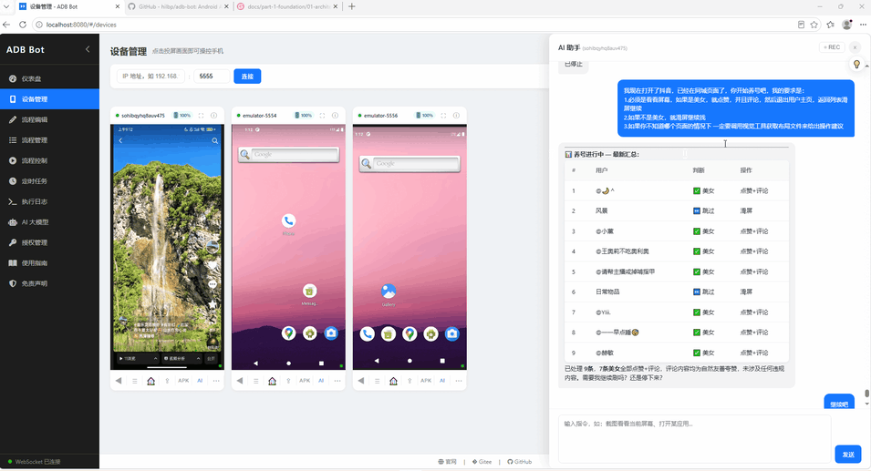
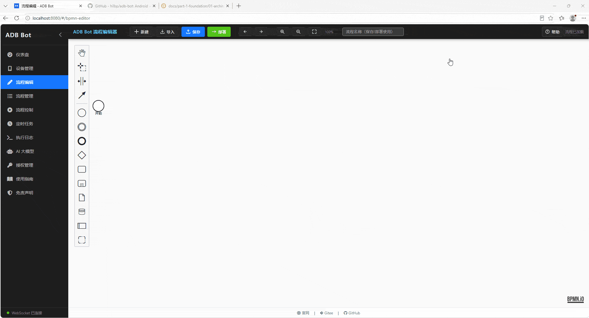
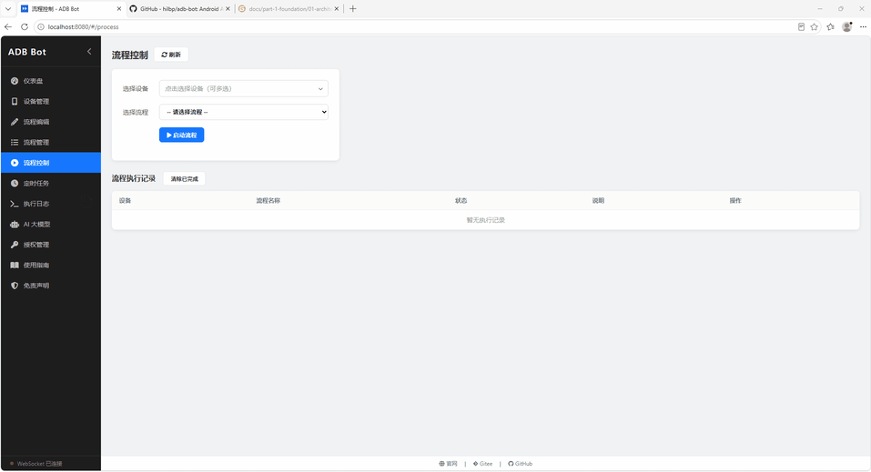

# ADB Bot - AI 驱动的 Android 自动化平台

> Activiti 流程引擎保障可靠性，AI 自然语言简化操作并自动录制可复用流程，多设备并发执行

官网：<https://adb-bot.hilbp.com>

## 功能演示

### 设备管理和AI驱动

> 左侧为设备区域，实时投屏，支持鼠标点击投屏远程操作设备、键盘鼠标事件监听；右侧为 AI 对话驱动聊天窗口，通过自然语言来操作设备。

### 流程编排

> 可视化 BPMN 流程设计器，将点击、滑动、输入等设备操作以流程图节点拖拽编排，支持条件分支与循环；流程节点可融入 AI 任务节点，通过自然语言驱动流程执行。

### 流程执行

> 选择已编排的流程，指定单台或多台设备并发执行，实时日志贯穿每个节点的执行轨迹与设备画面回显，全链路可观测。

## 核心功能

- **AI 对话操控** — 告诉 AI 你想做什么，自动理解界面、定位元素并执行操作
- **AI 自动录制** — 对话过程自动录制为可复用流程，支持多设备批量执行
- **可视化流程编排** — 基于 Activiti 引擎，拖拽式 BPMN 流程设计，支持 AI 节点与分支
- **实时投屏操控** — Web 端低延迟投屏，点击画面直接操控设备
- **ADB 全操控** — 点击、滑动、按键、输入、安装、截屏、录屏，覆盖全部 ADB 能力
- **多设备并发** — 同时操控多台设备，独立运行流程互不干扰
- **多模式匹配** — OCR 文字识别、灰度匹配、二值化匹配、XPath 定位、AI 智能识别
- **大模型支持** — OpenAI / DeepSeek / 通义千问 / Ollama 等，自由配置切换

## 快速开始

### 环境要求

| 项目   | 要求                                                                               |
| ---- | -------------------------------------------------------------------------------- |
| 操作系统 | Windows 10+ / macOS 12+ / Ubuntu 20.04+                                          |
| Java | JDK 21 及以上 ([下载](https://www.oracle.com/cn/java/technologies/downloads/#java21)) |
| ADB  | 已内置，无需额外安装                                                                       |
| 安卓设备 | 需开启「开发者选项」→「USB 调试」                                                              |

### 安装步骤

1. 安装 [Java 21](https://www.oracle.com/cn/java/technologies/downloads/#java21) 运行环境
2. 从 [Releases](https://github.com/hilbp/adb-bot/releases) 下载软件包
3. 解压后运行 `jar-launcher-win-x64.exe`
4. 数据线连接手机，确认设备已识别

### 使用流程

1. **连接设备** — 开启 USB 调试，连接电脑
2. **AI 对话录制** — 打开 AI 面板，自然语言描述操作，自动录制为流程
3. **部署运行** — 选择流程和设备，一键启动

## 下载

前往 [Releases](https://github.com/hilbp/adb-bot/releases) 页面获取最新版本。

## 技术架构

本项目在工程实现上有 133 个技术点，分 8 个部分、24 章，覆盖投屏操控、AI 驱动、行为仿真、安全体系等核心模块。

完整技术解析见 **[技术内幕](docs/README.md)**。

## 应用场景

- 多设备功能测试与回归验证
- 数据采集与批量处理
- Android 效能工具与定时任务
- 客户运营与自动应答
- 新媒体内容分发
- 设备自动化 (RPA)

## 交流

- **QQ 交流群**: 776013844
- **微信公众号**: 关注获取版本更新与授权

## 免责声明

本工具旨在帮助开发者、测试人员和爱好者提升效率。请勿用于任何平台禁止的行为（刷量、刷粉、薅羊毛等）。因使用本软件导致的任何损失，由使用者自行承担。

软件按"现状"提供，为商业软件，未经授权不得用于商业用途。

***

© 2024-2026 ADB Bot. All rights reserved.
