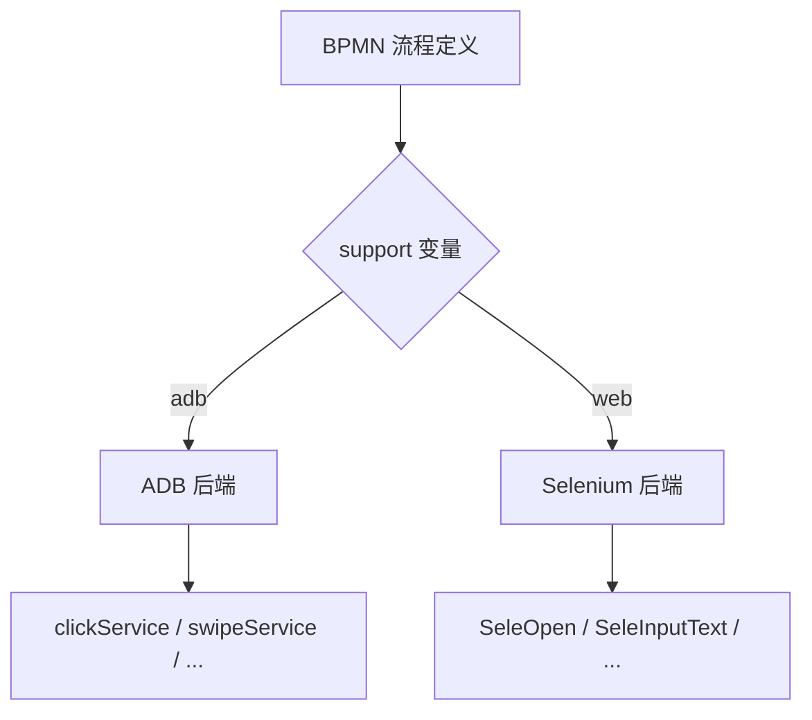

# 附录 A Selenium Web 自动化引擎

> ADB 与 Selenium 双后端架构，Activiti 统一编排，support 变量分流。

---

adb-bot 的流程引擎不只控制 Android 设备，还预留了 Web 自动化（Selenium）后端。两者共享同一套 BPMN 流程定义和 Activiti 引擎，通过 `support` 变量切换执行后端。

## 架构设计



### AbstractSeleAction 模板方法

Web 动作服务继承 `AbstractSeleAction`，模板方法固化三段式：

```
beforExecute（前置校验）→ operate（子类实现）→ afterExecute（后置处理）
```

与 ADB 后端的 `ActionGuardUtil` 三段式对称，流程定义不需要关心后端差异。

### BpmnError 域异常

Web 后端的错误处理用 `BpmnError`（Activiti 内置的流程级异常），与 ADB 后端的 `RuntimeException` 分层。`BpmnError` 可以被 BPMN 的边界错误事件捕获，实现流程内的错误处理分支。

## 现状

| 动作 | 状态 | 说明 |
|------|------|------|
| Open (SeleOpen) | 已实现 | 打开 URL |
| Manual (SeleManual) | 已实现 | 手动操作标记 |
| InputText | 空壳 | 方法签名已定义，逻辑未实现 |
| Init | 空壳 | 初始化未实现 |
| ManualService | 注释 | 整体注释，未启用 |

### 反检测设计

- **Chrome 119 自动解压**：运行时自动解压 ChromeDriver，不需要本地安装
- **ThreadLocal 线程隔离**：每个流程实例在独立线程上运行，WebDriver 实例线程级隔离
- **UserAgent 池**：移动/PC UA 随机切换，防止 Selenium 特征被检测

## 后续规划

Selenium 后端目前是实验性的，架构已经预留完整扩展点。后续如果需要 Web 自动化能力，只需实现空壳动作的 `operate()` 方法即可。

## 关键代码

| 类/方法 | 说明 |
|---------|------|
| `AbstractSeleAction` | Web 动作模板方法基类 |
| `SeleOpen` | 打开 URL |
| `ChromeDriverService` | Chrome 生命周期管理 |

---

> 本文是《adb-bot 技术内幕》系列附录 A。
> 更多内容见 [GitHub 仓库](../../README.md) | [官网](https://adb-bot.hilbp.com)
>
> [← 第 24 章 数据保护](../part-8-security/24-data-protection.md) ｜ [目录](../README.md) ｜ [附录 B 技术点索引表 →](b-tech-index.md)
