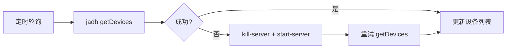

# 第 2 章 设备发现与并发治理

> 轮询式设备发现、统一缓存管理、按设备隔离的 CAS 锁、ThreadLocal 设备绑定。

---

所有操作都围绕"设备"展开。在多设备环境下，需要解决三个问题：怎么发现设备、怎么缓存设备信息、怎么防止多线程操作同一台设备时冲突。

## 核心设计

### 轮询式设备发现

没有用 jadb 的事件驱动监听器（`MyDeviceDetectionListener`），而是用轮询。原因：jadb 的事件监听依赖 ADB server 的 push 通知，在网络设备（adb connect）场景下不可靠。轮询虽然笨，但稳定。

**ADB server 自愈**：`getDevices` 失败时，自动执行 `kill-server` → `start-server` → 重试。ADB server 崩溃是常见问题（尤其是长时间运行后），自愈机制保证服务可用。

### DeviceCacheManager 统一缓存

设备信息分散在多个维度：触摸参数（getevent 探测结果）、任务状态（锁/中断标志）、屏幕尺寸等。`DeviceCacheManager` 用 `ConcurrentHashMap<String, DeviceCache>` 按 serial 统一管理。

`DeviceCache` 有两类属性：
- **静态懒加载**：触摸 profile（首次 sendevent 时探测，后续复用）
- **运行时状态**：`AtomicReference<String> taskOwner`（设备锁）和 `volatile boolean stopFlag`（中断标志）

**ThreadLocal 设备绑定**：`ThreadLocal<JadbDevice> CURRENT_DEVICE` 绑定当前线程操作的设备。流程引擎和条件表达式求值器通过它获取"我现在在操作哪台设备"，不需要层层传参。

**脏数据清理**：每次刷新设备列表时，`invalidateOffline(Set)` 用 `retainAll` 移除已离线设备的缓存，防止内存泄漏。

### CAS 设备锁

用 `AtomicReference.compareAndSet(null, desc)` 实现无锁化的设备排他：

- 期望 null（空闲）→ 设为 desc（任务描述）→ true
- 期望非 null → CAS 失败 → false

每台设备独立锁对象（`DeviceCache` 内的 `AtomicReference`），多台设备并发操作互不阻塞。

锁持有者 desc 用于诊断展示（"设备正忙，正在执行：AI指令"），用户知道该等谁。

详见第 9 章的并发控制部分。

## 关键代码

| 方法 | 说明 |
|------|------|
| `DeviceCacheManager.get()` | 按 serial 获取/创建缓存 |
| `DeviceCacheManager.getCurrentDevice()` | ThreadLocal 设备获取 |
| `DeviceCacheManager.invalidateOffline()` | 批量清理离线设备 |
| `DeviceTaskState.tryLock()` | CAS 抢锁 |
| `DeviceTaskState.unlock()` | 释放锁 |

---

> 本文是《adb-bot 技术内幕》系列第 2 章。
> 更多内容见 [GitHub 仓库](../../README.md) | [官网](https://adb-bot.hilbp.com)
>
> [← 第 1 章 系统全景与架构哲学](01-architecture-overview.md) ｜ [目录](../README.md) ｜ [第 3 章 scrcpy 视频流链路 →](../part-2-mirror/03-scrcpy-pipeline.md)
