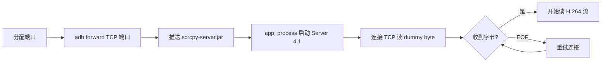
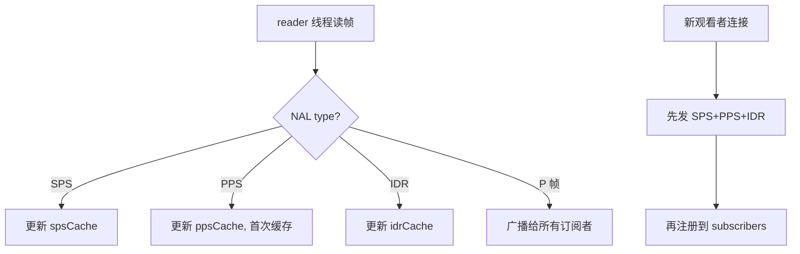

# 第 3 章 scrcpy 视频流链路

> 纯 video 单 socket 模式启动 scrcpy server，端口映射 + dummy byte 就绪检测 + 基准帧缓存保证多观看者不花屏。

---

投屏是 adb-bot 的基础体验。用户打开设备卡片就想看到实时画面，多个标签页看同一台设备也不该卡顿。底层用 scrcpy 的 server 方案——它直接从设备端编码 H.264 视频流推送到电脑端，延迟远低于 screenrecord + pull 方案。

## 核心设计

### scrcpy server 启动

启动命令核心参数：

| 参数 | 值 | 理由 |
|------|---|------|
| video | true | 只要视频流 |
| audio | false | 不需要音频 |
| control | false | 不用 scrcpy 的控制协议（自己实现） |
| max_size | 1024 | 平衡清晰度和带宽 |
| max_fps | 24 | 足够流畅，不过度消耗 CPU |
| tunnel_forward | true | 前向连接更稳定 |

通过 `CLASSPATH + app_process` 方式在设备端启动 Java 进程，不需要安装 scrcpy APK。

### 端口映射 + scid 隔离

每台设备分配一个固定端口（基准 27183），用 `ConcurrentHashMap<serial, Integer>` + `computeIfAbsent` 保证同一设备始终复用同一端口。

scid（scrcpy 内部标识）= `port - 27182`，socket 名 `localabstract:scrcpy_{scid的8位十六进制}`。多台设备互不干扰。

### dummy byte 就绪检测

`tunnel_forward=true` 模式下有个陷阱：`adb forward` 会立即 accept TCP 连接，但设备端的 scrcpy server 可能还没启动完。如果这时候开始读流，会读到 EOF。

解决：连接后先读一个 dummy byte。收到任意字节代表 server 就绪；收到 EOF（-1）则关闭重连。最多重试 30 次（每次 200ms），超时抛异常。

### 基准帧缓存：多观看者不花屏

H.264 流中，P 帧依赖前面的 I 帧（IDR）才能正确解码。如果一个新观看者在 P 帧到达时才加入，它会收到无法解码的残缺帧——画面花屏。

解决方案：缓存最近的 SPS、PPS、IDR 三个基准帧。新观看者连接时，先发送基准帧让 JMuxer 初始化解码器，**然后再注册到 subscribers map**。

这个时序很关键：如果先注册再发基准帧，实时 P 帧可能在基准帧之前到达，照样花屏。

NAL 解析：遍历字节流，识别 `00 00 00 01` 起始码，取 NAL type（`& 0x1F`）：type=7 → SPS，type=8 → PPS，type=5 → IDR。

### ConcurrentWebSocketSessionDecorator 异步发送

每个 WebSocket session 包装为 `ConcurrentWebSocketSessionDecorator(session, 500ms, 2MB)`。`sendMessage` 立即返回，消息在后台队列投递。

没有这个包装，如果某个客户端网络慢（发送阻塞），reader 线程会被卡住，导致所有观看者都卡屏。装饰器把同步发送变成异步，reader 线程永远不会被单个慢客户端拖住。

### 会话复用

多个标签页看同一台设备时，第二个标签页连接时检查 `isRunning()`，如果 scrcpy 已在运行，直接复用现有 reader 线程，不重启 scrcpy。避免反复启动 kill 的资源浪费。

## 关键代码

| 方法 | 说明 |
|------|------|
| `ScreenMirrorSession.startScrcpy()` | server 启动 + dummy byte 检测 |
| `VideoWebSocketHandler.extractSpsPps()` | H.264 NAL 解析 |
| `VideoWebSocketHandler` | 基准帧缓存 + 多观看者广播 |

---

> 本文是《adb-bot 技术内幕》系列第 3 章。
> 更多内容见 [GitHub 仓库](../../README.md) | [官网](https://adb-bot.hilbp.com)
>
> [← 第 2 章 设备发现与并发治理](../part-1-foundation/02-device-and-concurrency.md) ｜ [目录](../README.md) ｜ [第 4 章 前端解码与追帧策略 →](04-decode-and-catchup.md)
