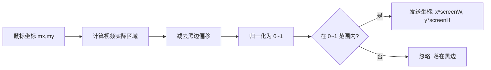

# 第 5 章 操控交互转发

> 坐标归一化换算、inputProxy 焦点桥接、键盘事件映射、文字输入缓冲、IME 组词处理。

---

投屏不只是"看"，还要能"操作"。用户在投屏画面上点击、滑动、打字，需要精确转发到设备端。但浏览器的交互模型和 Android 触控有巨大的语义鸿沟，填这个鸿沟是这一章的主题。

## 核心设计

### 坐标归一化换算

投屏画面用 `object-fit: contain` 显示，意味着视频内容可能无法铺满容器，上下或左右会出现黑边。用户点击黑边区域是无效的，点击画面区域的坐标需要换算为设备屏幕坐标。

根据 video 的宽高比 `aspect` 和容器尺寸计算实际内容区域，减去黑边偏移后归一化为 0~1 的设备坐标。超出 0~1 范围的点击直接忽略。

### inputProxy 焦点桥接

HTML5 的 `<video>` 元素无法接收键盘事件（大多数浏览器的行为）。但用户期望点击投屏画面后就能直接打字。

解决方案：创建一个 1×1 像素、`opacity:0` 的隐藏 `<input>` 元素作为 IME 输入代理。用户点击 video 区域后，inputProxy 获得焦点，所有键盘事件通过它转发。

### 键盘事件映射

| 浏览器按键 | Android 按键 | 说明 |
|-----------|-------------|------|
| 字母/数字/符号 | 文字输入缓冲 | 100ms 合并批量发送 |
| Backspace | DEL (67) | 删除一个字符 |
| 方向键 ← → ↑ ↓ | DPAD (21/22/19/20) | 移动输入框光标 |
| Enter | ENTER (66) | 确认/提交 |
| Shift + Enter | 文案匹配点击 | 智能点击"发送"按钮 |
| Esc | BACK (4) | Android 返回 |

### 文字输入缓冲

单字符逐次发送 API 太频繁。做法是累积字符到 `inputBuffer`，设置 100ms 定时器。新按键重置定时器，定时器到期时批量提交。Backspace 和 Enter 前先 flush 缓冲，保证顺序正确。

### IME 组词三段式

中文输入法的组词过程（拼音输入）通过 composition 事件处理：

1. `compositionstart`：标记正在组词，期间忽略所有 keydown
2. `compositionupdate`：记录拼音原文（仅 a-z）
3. `compositionend`：先 flush 英文缓冲，再提交中文结果 + pinyin 参数

组词期间的按键放行很重要：如果不忽略，拼音输入过程中的字母键会被当作英文输入直接发送到设备。

### Shift + Enter 智能发送

Enter 键默认映射为 Android 回车键。但很多 App 的聊天框中，回车是换行而不是发送，发送需要点击屏幕上的"发送"按钮。

Shift + Enter 的特殊处理：先按文案查找"发送""Send""傳送"等按钮（中英繁三语匹配），找到则 tap-by-text 点击，找不到则降级为 keyevent 66（回车）。

### 操作手势区分

基于移动阈值（0.03 归一化坐标）和时长区分四种手势：

| 手势 | 判定条件 |
|------|---------|
| 点击 | 移动 < 0.03 且时长 < 800ms |
| 长按 | 按住 800ms 未移动 |
| 滑动 | 松手时移动 > 0.03 且时长 < 800ms |
| 拖拽 | 松手时移动 > 0.03 且时长 ≥ 800ms |

长按不用等松手判定：按住 800ms 未移动即触发。这是因为部分场景的长按需要即时反馈（如拖出快捷菜单）。

## 关键代码

| 文件/方法 | 说明 |
|----------|------|
| `mirror-touch.js` getNormCoord() | 坐标归一化 + 黑边补偿 |
| `mirror-touch.js` inputProxy | 1px 隐藏 input 焦点桥接 |
| `mirror-touch.js` flushInput() | 100ms 文字缓冲提交 |
| `mirror-touch.js` composition 三段式 | IME 组词处理 |

---

> 本文是《adb-bot 技术内幕》系列第 5 章。
> 更多内容见 [GitHub 仓库](../../README.md) | [官网](https://adb-bot.hilbp.com)
>
> [← 第 4 章 前端解码与追帧策略](04-decode-and-catchup.md) ｜ [目录](../README.md) ｜ [第 6 章 日志实时推送 →](06-log-streaming.md)
