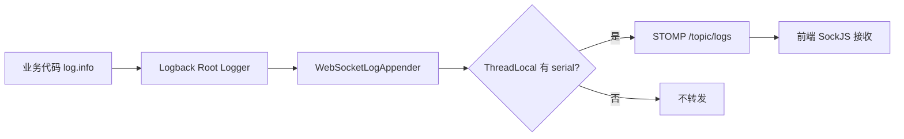

# 第 6 章 日志实时推送

> Logback Appender 桥接 STOMP WebSocket，ThreadLocal 设备上下文路由，环形缓冲首次回补。

---

用户在操作设备时，希望实时看到操作日志（"点击了哪里""滑动了什么方向""OCR 识别了什么"）。传统做法是轮询 API 拉日志，但延迟大、浪费请求。adb-bot 用 Logback Appender + WebSocket 实现日志的实时推送。

## 核心设计

### Logback → STOMP 桥接

自定义一个 Logback Appender（`WebSocketLogAppender`），注册到 Root Logger 上。所有 `log.info()` / `log.warn()` 都会流经这个 Appender。

但不是所有日志都推给前端——系统启动日志、Spring 框架日志用户不关心。用 `ThreadLocal<String>` 绑定设备序列号：只有当前线程上下文中设置了 serial 的日志（即设备操作相关日志）才转发到 WebSocket。

### ThreadLocal 设备上下文路由

设备操作前，`DeviceCacheManager.setCurrentDevice(device)` 在 ThreadLocal 中设置 serial。这个 serial 伴随整个调用链（AI 工具执行 → ADB 命令 → 日志输出）。Appender 读取 ThreadLocal 中的 serial，决定日志是否转发。

这样不需要改业务代码加 `if (shouldPushLog)` 判断，路由完全透明。

### 环形缓冲

用户打开日志面板时，不应该只看到从这一刻开始的日志。`LogBuffer` 是一个 200 条上限的环形缓冲，存储最近的日志。前端首次连接时，先回补缓冲区中的历史日志，然后开始接收实时推送。

### SockJS 降级

WebSocket 在部分网络环境（公司代理、旧浏览器）下不可用。SockJS 提供自动降级：先尝试 WebSocket，失败则降级到 XHR streaming / XHR polling。

STOMP 协议运行在 SockJS 之上，提供 subscribe/publish 语义。前端订阅 `/topic/logs` 即可收到日志推送。

### volatile + 静态注入

`WebSocketLogAppender` 由 Logback 框架创建（不在 Spring 容器中），但需要 `SimpMessagingTemplate` 来发送消息。这个矛盾用静态字段 + `@PostConstruct` 注入解决：Spring 启动后通过 `@PostConstruct` 把 `SimpMessagingTemplate` 赋给 Appender 的静态字段。Appender 发送消息时检查静态字段是否为 null（防止启动阶段 NPE）。

## 关键代码

| 类/方法 | 说明 |
|---------|------|
| `WebSocketLogAppender` | Logback Appender + STOMP 桥接 |
| `LogBuffer` | 200 条环形缓冲 |
| `DeviceCacheManager.setCurrentDevice()` | ThreadLocal serial 绑定 |
| `WebSocketConfig` | SockJS + STOMP 端点配置 |

---

> 本文是《adb-bot 技术内幕》系列第 6 章。
> 更多内容见 [GitHub 仓库](../../README.md) | [官网](https://adb-bot.hilbp.com)
>
> [← 第 5 章 操控交互转发](05-input-forwarding.md) ｜ [目录](../README.md) ｜ [第 7 章 双模型适配层 →](../part-3-ai/07-dual-model-adapter.md)
