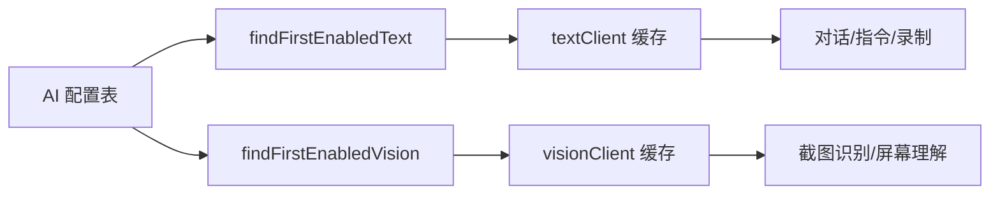

# 第 7 章 双模型适配层

> OpenAI 兼容协议统一接入，文本模型与多模态模型分离缓存，配置热更新零重启。

---

adb-bot 的 AI 能力需要同时支持两种场景：纯文本对话（理解用户指令、调用工具）和多模态识别（看屏幕截图做决策）。这两种场景对模型的要求不同，用同一个模型既浪费又不稳定。

## 核心设计

### OpenAI 兼容协议：一个适配层接所有模型

没有为每个模型厂商写一套 SDK 适配，而是统一用 OpenAI 的 `/chat/completions` 协议。原因很简单：主流模型（通义千问、DeepSeek、智谱 GLM、Ollama 本地、OpenAI 原版）都兼容这个协议。

只需要三个参数：`baseUrl`（API 地址）、`apiKey`（密钥）、`model`（模型名）。用户在前端填这三个值，后端动态构建 `OpenAiChatModel`，不依赖 Spring AI 的自动配置（它从 yml 读取，改了要重启）。

### 双缓存分离

两个 `ChatClient` 独立缓存，按优先级从数据库选取：

- **textClient**：优先选 `multimodal=false` 的纯文本模型（便宜快），无则回退到任意启用配置
- **visionClient**：只选 `multimodal=true` 的多模态模型，可能为 null（未配置时不报错，调用方降级处理）

### 多模态可用性探测

用户配置多模态模型后，不能假设它一定支持图片输入。比如部分模型的 API 声称兼容图片但实际会返回错误。

探测方式：发送一张 256×256 的纯色 PNG 测试图，只要不抛异常就算支持。

为什么是 256×256 而不是更小的图？因为 GLM-4V 等多模态模型的视觉编码器有最小 patch 尺寸要求（通常基于 224×224 的 ViT），发送 8×8 的图片会被直接拒绝。

### 配置热更新

用户在前端修改 AI 配置后，调用 `evictCache()` 清空两个缓存。下次对话时懒加载重建。整个过程不需要重启服务。

`volatile` + 双重检查锁保证缓存的线程安全：`getChatClient()` 先读 volatile（无锁快路径），为 null 才进 synchronized 块构建。

### SSE 流式对话

对话支持两种返回模式：同步（`.call()` 阻塞等待完整响应）和流式（`.stream()` 返回 `Flux<String>`）。流式通过 SSE 推给前端，120 秒超时。

流式的 `doFinally` 保证设备锁在流结束（无论正常完成还是异常）时释放。

## 关键代码

| 方法 | 说明 |
|------|------|
| `ChatClientFactory.getChatClient()` | 文本模型缓存（volatile + DCL） |
| `ChatClientFactory.getVisionClient()` | 多模态模型缓存（可能为 null） |
| `ChatClientFactory.buildAndTestVision()` | 256×256 PNG 探测 |
| `ChatClientFactory.evictCache()` | 配置变更清空缓存 |
| `ChatClientFactory.buildChatClient()` | OpenAiApi + OpenAiChatModel 构建 |

---

> 本文是《adb-bot 技术内幕》系列第 7 章。
> 更多内容见 [GitHub 仓库](../../README.md) | [官网](https://adb-bot.hilbp.com)
>
> [← 第 6 章 日志实时推送](../part-2-mirror/06-log-streaming.md) ｜ [目录](../README.md) ｜ [第 8 章 Function Calling 工具体系 →](08-function-calling.md)
