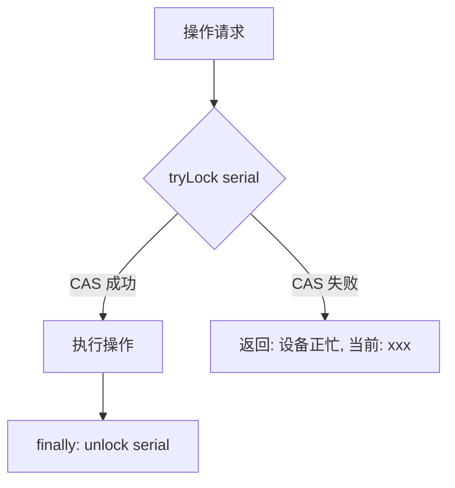
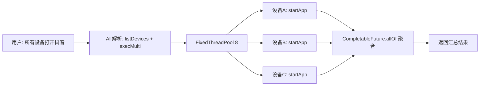

# 第 9 章 并发与中断控制

> 设备级排他锁保证操作原子性，按设备隔离的中断标志支持即时停止，群控线程池并发调度。

---

AI 对话、流程执行、手动操作——三种来源的操作可能同时指向同一台设备。如果两个操作并发执行（比如 AI 正在点击，流程也在滑动），设备行为不可预测。

同时，用户需要能随时中断正在执行的操作（"停！别滑了"）。这要求中断信号能穿透正在运行的工具函数。

## 核心设计

### 设备排他锁：CAS 无锁化

用 `AtomicReference<String>` 的 `compareAndSet(null, desc)` 实现独占：

- 期望值 null（空闲）→ 设为 desc（任务描述）→ 返回 true
- 期望值非 null（忙）→ CAS 失败 → 返回 false

这是一把严格的排他锁，不支持重入。每台设备独立锁对象（按 serial 隔离在 `DeviceCache` 中），互不干扰。

锁的持有者（desc）用于诊断：当第二个操作被拒绝时，返回"设备正忙，正在执行：AI指令"，用户知道该等谁。

### 中断标志：按设备隔离

`ProcessStopFlag` 是一个 volatile 布尔标志，按 serial 存储在 `DeviceCache` 中。

每个工具函数在执行前和执行中（循环体内）都检查 `ProcessStopFlag.isStopped(serial)`，为 true 则立即返回"操作已取消"。

为什么不用 `Thread.interrupt()`？因为 AI 的工具调用链可能在 Reactor 线程上执行，interrupt 会干扰 Spring AI 的流式处理。按设备隔离的标志位更可控，且能精确中断指定设备的操作而不影响其他设备。

### 群控并发调度

群控用 8 线程的 FixedThreadPool，每台设备在独立线程上执行。每台设备仍需独立加锁（群控内部自动处理），如果某台设备正在被其他操作占用，该设备的操作会被跳过并返回"设备正忙"。

`CompletableFuture.allOf().join()` 等待所有设备完成后汇总结果。线程池用守护线程（`setDaemon(true)`），JVM 退出时自动回收。

### AI 可抢占非 AI 任务

当 AI 对话获取设备锁时，如果锁的持有者是流程引擎（非 AI），AI 可以等待或提示用户。但反过来，流程引擎不会抢占 AI 正在执行的操作——AI 操作优先级更高，因为它是用户实时交互。

### 三段式停止

流程引擎的中断更复杂，需要三步协同：

1. `ProcessStopFlag.set(serial, true)` — 设置标志位
2. `thread.interrupt()` — 中断阻塞操作（如 Thread.sleep）
3. `deleteProcessInstance()` — 从 Activiti 引擎删除流程实例

三者缺一不可：只设标志位，正在 sleep 的线程不会醒；只 interrupt，循环体内可能已经过了标志检查点；只删实例，正在执行的动作不会停。

## 关键代码

| 方法 | 说明 |
|------|------|
| `DeviceTaskState.tryLock()` | CAS 抢锁 |
| `DeviceTaskState.unlock()` | 释放锁 |
| `DeviceTaskState.getOwner()` | 查询当前持有者 |
| `ProcessStopFlag.isStopped()` | 中断标志检查 |
| `ProcessStopFlag.clear()` | 清除标志（新操作开始时） |
| `DeviceActionTools.execMulti()` | 群控并发调度 |
| `DeviceActionTools.execOnDevice()` | 单设备加锁执行 |

---

> 本文是《adb-bot 技术内幕》系列第 9 章。
> 更多内容见 [GitHub 仓库](../../README.md) | [官网](https://adb-bot.hilbp.com)
>
> [← 第 8 章 Function Calling 工具体系](08-function-calling.md) ｜ [目录](../README.md) ｜ [第 10 章 零侵入 AOP 录制 →](../part-4-process/10-aop-recording.md)
