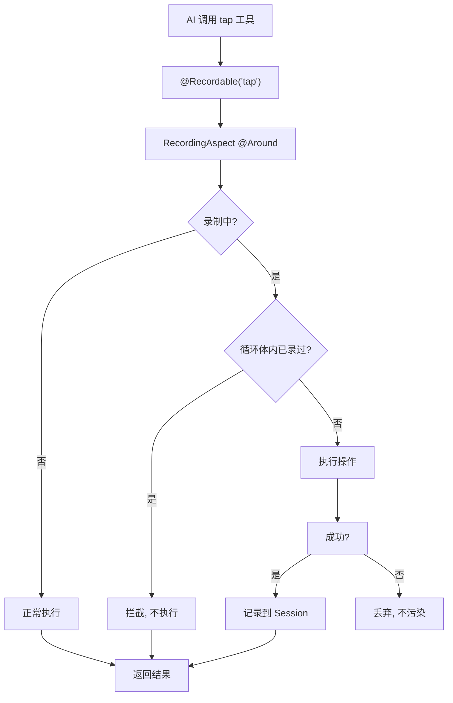

# 第 10 章 零侵入 AOP 录制

> @Recordable 注解 + AOP 切面旁路录制，工具方法对录制状态零感知。

---

AI 对话可以控制设备，但对话是一次性的——用户说"打开抖音搜索猫咪"，AI 执行完就结束了。下次还得再说一遍。

录制引擎的目标是：把 AI 的操作过程自动记录下来，生成可复用的自动化流程。关键约束是**不能侵入工具方法的代码**——工具方法只该关心"怎么执行操作"，不该关心"是否在录制"。

## 核心设计

### 注解声明，切面拦截

`@Recordable` 注解只声明两件事：
- `value`：操作类型（tap / swipe / startApp ...）
- `controlType`：控制流标记（conditionStart / conditionEnd / 空）

不含任何录制逻辑。贴在 AI 的 `@Tool` 方法上即获得录制能力。

### 切面只做两件事

`RecordingAspect @Around` 的职责极其克制：

1. **前置**：问 RecordManager "这个动作该不该执行"（循环去重判断）
2. **后置**：把执行结果封装为 `ActionExecutedEvent` 转发给 RecordManager

切面不做任何录制状态判断。是否在录制、是否去重、是否成功——这些决策全部下沉到 RecordManager。切面零状态，纯编排。

### 事件驱动解耦

`ActionExecutedEvent` 是一个 record（不可变值对象），只携带"发生了什么"的事实：serial、actionType、params、controlType、success。

切面发布事件，RecordManager 订阅事件。两者通过事件解耦，意味着将来如果有其他消费者（如审计日志、操作回放），只需要新增订阅者，不改切面代码。

### 失败不污染录制

只有 `event.success() == true` 的操作才被记录。失败的操作被丢弃。

为什么？因为生成的 BPMN 流程要求可重放。如果录制了失败的操作，回放时也会失败。丢弃失败步骤保证了生成出的流程都是成功路径。

判断标准是约定式的：工具返回的字符串包含"失败"二字视为失败。这依赖工具方法的返回值约定，虽然不够严格，但足够简单。

### 参数快照

切面通过 `MethodSignature.getParameterNames()` 反射获取形参名，按位置组装参数 Map。自动剔除 `serial`（会话标识，不是节点字段）。

这样录制下来的参数可以直接填入 BPMN 节点的 extensionElements 字段，不需要二次转换。

## 关键代码

| 方法 | 说明 |
|------|------|
| `RecordingAspect.aroundRecordable()` | @Around 拦截 + 事件转发 |
| `RecordingAspect.extractParams()` | 反射参数快照 |
| `Recordable` | 注解定义（value + controlType） |
| `ActionExecutedEvent` | 事件载体（record 值对象） |
| `RecordManager.handleAction()` | 录制决策入口 |

---

> 本文是《adb-bot 技术内幕》系列第 10 章。
> 更多内容见 [GitHub 仓库](../../README.md) | [官网](https://adb-bot.hilbp.com)
>
> [← 第 9 章 并发与中断控制](../part-3-ai/09-concurrency-control.md) ｜ [目录](../README.md) ｜ [第 11 章 BPMN 自动生成算法 →](11-bpmn-generation.md)
