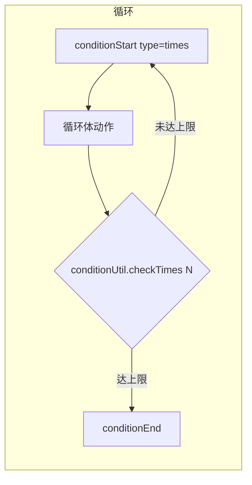

# 第 11 章 BPMN 自动生成算法

> 录制步骤序列自动映射为 BPMN 2.0 XML，含节点类型转换、控制流映射、图形坐标自动布局。

---

录制引擎记录下的是一系列操作步骤（tap、swipe、startApp...），但用户需要的是一个可编辑、可部署、可视化管理的流程。BPMN 2.0 是流程引擎的标准格式，也是流程编辑器能直接渲染的格式。

这一章解决的问题是：怎么把线性的步骤列表变成结构化的 BPMN 流程图。

## 核心设计

### 步骤 → 节点映射

每个录制步骤根据工具名映射为对应的 BPMN serviceTask：

| 工具名 | delegateExpression | 映射逻辑 |
|--------|-------------------|---------|
| startApp | `${openService}` | packageName + 等待时间 |
| tap | `${clickService}` | 按优先级生成定位表达式 |
| swipe | `${swipeService}` | dx/dy 判方向 + 循环字段 |
| inputText | `${sendMessageService}` | textSourceType=direct |
| pressKey | `${keyeventService}` | keycode → 中文语义名 |
| back | `${backService}` | 无字段 |
| aiTask | `${aiTaskService}` | prompt 字段 |

tap 的定位表达式生成有优先级：text+resourceId > contentDesc+resourceId > text > contentDesc > 纯坐标。这样回放时优先用稳定的元素定位，坐标兜底。

### 控制流映射

| conditionStart type | 生成的连线条件 | 语义 |
|---------------------|--------------|------|
| times | `${conditionUtil.checkTimes(N)}` | 循环 N 次 |
| timeout | `${!conditionUtil.checkTimeout(N)}` | 未超时则继续 |
| page | `${conditionUtil.isTargetPage('X')}` | 页面分支 |

循环体的关键是**回环连线**：从循环体末尾生成一条带条件表达式的 sequenceFlow 指回循环体起始节点。分支则需要收集各分支尾节点，在汇合点连多条入线。

### 循环体智能去重

AI 在循环体内的行为有个问题：它可能反复调用同一个工具（比如循环翻页时反复 swipe）。如果每次都录制，生成的流程会有大量重复节点。

去重机制分两层：

**第一层（切面前置拦截）**：RecordManager 维护一个 `loopTools` Set，记录循环体内已录制的工具类型。切面在执行前询问"这个动作该不该执行"，如果 `loopTools` 已包含该工具类型，直接拦截不执行（返回 REJECT_MSG）。

**第二层（自动结束循环）**：如果拦截累计达 3 次（`MAX_LOOP_REJECT = 3`），说明 AI 在循环体内找不到新动作了，自动注入 `endCondition` 步骤结束循环。

这个设计意味着：AI 不需要知道"循环什么时候结束"，它只管执行操作，RecordManager 根据执行频次推断循环边界。

### 图形坐标自动布局

BPMN XML 不只有语义节点和连线，还有 BPMNDI 图形坐标信息（否则编辑器无法渲染）。

布局策略是自左向右流水线：

- X 轴：cursor 从 180 起，每个任务推进 200px（120 宽 + 80 间距）
- Y 轼三线分层：主流程 y=200、循环回环 y=380、条件分支 y=100
- 连线从节点边缘生成而非中心（通过 `nodeInfo` 记录每个节点的中心坐标和半宽）

这样生成的流程图在编辑器中打开时已经是合理布局，不需要手动拖拽。

### XML 安全

所有用户输入（应用名、文本内容、XPath）都经过 `escapeXml` 转义 `& < > " '`，防止注入破坏 XML 结构。

### AI 决策节点

`aiTask` 类型的步骤在录制时只存 prompt，不执行任何设备操作。回放时（流程引擎执行到这个节点），才现场调用 AI 让它根据当前屏幕状态做决策。

这是录制和回放的关键差异：录制的操作是确定性的（固定坐标、固定文本），而 AI 决策节点是非确定性的（每次回放结果可能不同），适合处理弹窗、动态内容等不确定场景。

## 关键代码

| 方法 | 说明 |
|------|------|
| `RecordManager.generateBpmn()` | 步骤序列 → BPMN XML |
| `RecordManager.convertStep()` | 单步骤 → BPMN 节点定义 |
| `RecordManager.addWaitFields()` | 等待时间注入 |
| `RecordManager.shouldBlockExecution()` | 循环去重判断 |
| `RecordManager.handleAction()` | 自动结束循环 |

---

> 本文是《adb-bot 技术内幕》系列第 11 章。
> 更多内容见 [GitHub 仓库](../../README.md) | [官网](https://adb-bot.hilbp.com)
>
> [← 第 10 章 零侵入 AOP 录制](10-aop-recording.md) ｜ [目录](../README.md) ｜ [第 12 章 流程引擎集成 →](12-engine-integration.md)
