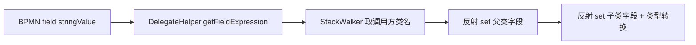

# 第 12 章 流程引擎集成

> Activiti 8 + Spring Boot 3 集成，delegateExpression 绑定动作服务，反射数据绑定 + 条件表达式求值。

---

BPMN XML 生成后，需要一个引擎来解析、部署、执行它。adb-bot 选择 Activiti（现 Flowable）作为流程引擎——它是 Java 生态最成熟的 BPMN 引擎，Spring Boot 集成完善，支持完整的 BPMN 2.0 规范。

## 核心设计

### delegateExpression 节点绑定

BPMN 的 serviceTask 有三种实现方式：Java class、表达式、委托表达式。adb-bot 用 `delegateExpression`：

```xml
<serviceTask id="task_1" name="点击登录" 
             activiti:delegateExpression="${clickService}">
  <extensionElements>
    <activiti:field name="template" stringValue="xpath||//node[@text='登录']"/>
  </extensionElements>
</serviceTask>
```

`${clickService}` 是 Spring Bean 的名称。流程引擎执行到这个节点时，从 Spring 容器找到 `clickService` Bean，调用其 `execute(DelegateExecution)` 方法。

每个动作服务实现 `JavaDelegate` 接口，通过 `ActionDataBinder` 从 BPMN 字段注入参数。

### 反射数据绑定

`ActionDataBinder.bind()` 把 BPMN 节点的 `<activiti:field>` 反射注入到 Action 实体：



绑定过程的几个设计决策：

**StackWalker 取调用方类名**：不硬编码 "clickService" → ClickAction 的映射，而是在运行时用 `StackWalker` 获取调用方的类名作为 action.type。新增动作服务时，只需类名遵循约定，不需要改绑定器。

**父类通用字段循环注入**：Action 基类的字段（template、waitTime 等）通过 `getSuperclass().getDeclaredFields()` 自动注入，子类特有字段在 fields 数组中显式声明。

**类型转换**：BPMN field 全是 String，但 Action 实体可能有 int / boolean 字段。`setValue` 根据 `field.getType()` 自动转换。

### 条件表达式求值

BPMN 的 `conditionExpression` 中可以写 EL 表达式调用 Spring Bean：

| 表达式 | 说明 |
|--------|------|
| `${conditionUtil.checkTimes(5)}` | 循环 5 次 |
| `${!conditionUtil.checkTimeout(30)}` | 未超 30 分钟 |
| `${conditionUtil.isTargetPage('com.xx/.Main')}` | 页面分支 |

`ConditionUtil` 是一个 `@Component`，注册到 Spring 容器后，Activiti 的 EL 解析器能直接找到它。

状态管理按 serial 隔离（`ConcurrentHashMap<String, Integer>`），用 `merge(serial, 1, Integer::sum)` 原子自增计数。退出循环时同步清理 map，避免下次残留脏状态。

### support 变量分流

流程启动时传入 `support` 变量（值为 "adb" 或 "web"），决定执行后端：

- `support=adb`：走 ADB 动作服务（本系列主要内容）
- `support=web`：走 Selenium 动作服务（实验性）

同一份 BPMN 定义可以切换后端，流程定义与执行后端解耦。

### 动作节点矩阵

| 节点 | Bean 名 | 功能 |
|------|---------|------|
| 打开应用 | openService | 启动指定 App |
| 点击 | clickService | 按定位策略点击 |
| 滑动 | swipeService | 方向/坐标滑动 |
| 输入文字 | sendMessageService | 文本输入 |
| 按键 | keyeventService | 返回/Home/菜单 |
| 返回 | backService | 返回上一页 |
| 截图保存 | saveScreenshotService | 保存画面 |
| 保存节点 | saveNodesService | 导出 UI 树 |
| 点击节点 | clickNodeService | XPath 点击 |
| AI 任务 | aiTaskService | 流程中 AI 决策 |
| 自定义 | customService | 扩展节点 |

## 关键代码

| 方法 | 说明 |
|------|------|
| `ActionDataBinder.bind()` | 反射字段注入 + StackWalker 类型推断 |
| `ConditionUtil.checkTimes()` | 次数循环计数 |
| `ConditionUtil.checkTimeout()` | 超时循环判断 |
| `ConditionUtil.isTargetPage()` | 页面匹配 |

---

> 本文是《adb-bot 技术内幕》系列第 12 章。
> 更多内容见 [GitHub 仓库](../../README.md) | [官网](https://adb-bot.hilbp.com)
>
> [← 第 11 章 BPMN 自动生成算法](11-bpmn-generation.md) ｜ [目录](../README.md) ｜ [第 13 章 生命周期与调度 →](13-lifecycle-and-schedule.md)
