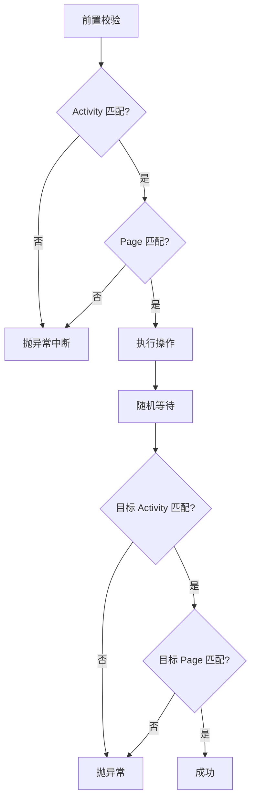
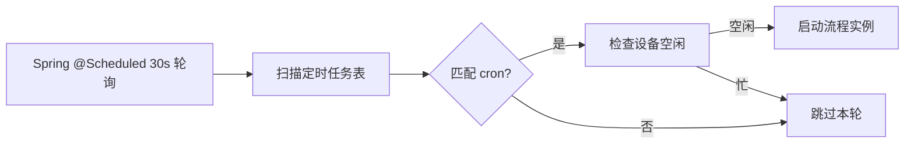

# 第 13 章 生命周期与调度

> 流程的三段式停止、动作守护的前后置校验、定时任务的手写 cron 调度。

---

流程引擎能执行 BPMN，但实际使用中还有一堆工程问题：怎么安全停止正在跑的流程？每个动作节点怎么校验是否执行成功？怎么定时执行？

## 核心设计

### 动作守护：前置 + 执行 + 后置

每个动作节点不只是"执行操作"，还要校验执行前后的状态：



**前置校验**：执行操作前先检查当前是否在预期的 Activity 和页面。如果用户在前置页就不对（比如 App 没打开），直接中断，避免无效操作。

**后置校验**：操作执行后随机等待一段时间（模拟人类反应时间），再检查是否到达了预期的目标页面。等待是随机的（min~max 毫秒），防止固定间隔被检测。

**随机等待**：`afterActionRandomWait(min, max)` 在每个动作后执行，这是行为级仿真的一部分（第 17 章详述）。

### 流程生命周期

```
编辑 → 部署（版本+1）→ 启动实例 → 运行 → 完成/失败/停止
```

**版本化部署**：同 key 的流程重复部署时自动版本 +1，旧版本的运行中实例不受影响。

**ProcessStatus 内存态管理**：运行状态（RUNNING / COMPLETED / FAILED / STOPPED）记录在内存 Map 中，不持久化。页面刷新时从这里读取实时状态。

### 三段式停止

用户点"停止"时，需要三步协同才能安全中断：


| 步骤 | 作用 | 单独用的后果 |
|------|------|------------|
| ProcessStopFlag | 工具函数循环检查点 | sleep 中的线程不醒 |
| thread.interrupt | 唤醒阻塞操作 | 循环体内可能已过检查点 |
| deleteProcessInstance | 从引擎删除实例 | 正在执行的动作不停 |

三者缺一不可。

### 定时任务调度



不用 Quartz，用 Spring 的 `@Scheduled` 30 秒轮询一次。每轮扫描数据库中的定时任务，匹配 cron 表达式，匹配则检查设备是否空闲，空闲则启动流程。

**手写 cron 解析**：支持三种模式——每 N 分钟、每 N 小时、每天 HH:MM。没有用完整的 cron 库，因为这三种模式覆盖了绝大多数自动化场景，手写解析更轻量。

### 设备互斥锁

流程启动前必须获取设备锁（`DeviceTaskState.tryLock`），获取失败则跳过本轮定时执行。这保证了定时任务不会和用户的手动操作或 AI 对话冲突。

## 关键代码

| 方法 | 说明 |
|------|------|
| `ActionGuardUtil.beforExecuteShell()` | 前置 Activity + Page 校验 |
| `ActionGuardUtil.afterExecuteShell()` | 后置校验 + 随机等待 |
| `ActionGuardUtil.click()` | 三段式模板方法 |
| `ProcessStopFlag.set()` | 中断标志 |
| `DeviceTaskState.tryLock()` | CAS 设备锁 |

---

> 本文是《adb-bot 技术内幕》系列第 13 章。
> 更多内容见 [GitHub 仓库](../../README.md) | [官网](https://adb-bot.hilbp.com)
>
> [← 第 12 章 流程引擎集成](12-engine-integration.md) ｜ [目录](../README.md) ｜ [第 14 章 sendevent 点击注入 →](../part-5-simulation/14-sendevent-injection.md)
