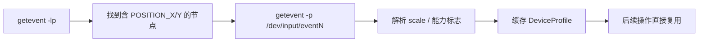

# 第 15 章 设备自动适配

> 用 getevent 自动探测触摸节点和参数，取代为每个机型手写配置。

---

sendevent 注入需要知道三件事：触摸设备节点名（event0? event4?）、坐标缩放比（屏幕分辨率和触摸板分辨率不同）、设备支持哪些 ABS 事件。传统做法是为每个机型写一个子类，维护一张配置表。机型一多就维护不过来。

adb-bot 的思路是：这些信息设备自己知道，问它就行。

## 核心设计

### 探测什么

| 信息 | getevent 字段 | 用途 |
|------|-------------|------|
| 触摸节点 | 含 `ABS_MT_POSITION_X` 和 `ABS_MT_POSITION_Y` 的设备块 | 确定写哪个 `/dev/input/eventN` |
| 坐标缩放 | `0035` (POSITION_X) 的 max 值 ÷ 屏幕宽度 | 屏幕坐标 → 触摸板坐标 |
| BTN_TOOL_FINGER | 设备是否支持 `0145` | 决定是否发手指标记事件 |
| ABS_MT_TOUCH_MAJOR | 设备是否支持 `002f`/`0030` | 决定是否发触摸面积事件 |

### 为什么不直接信任 event0

不同机型的触摸节点编号不同。小米可能是 event4，三星可能是 event1。固定写死 event0 在部分机型上会写入错误的设备节点，导致事件丢失或触发意外行为。

`getevent -lp` 列出所有 input 设备及其能力，我们找到同时具备 `POSITION_X` 和 `POSITION_Y` 的那块——这就是触摸屏。

### scale 的坑

触摸板分辨率和屏幕分辨率不一定相同。比如屏幕 1080px 宽，触摸板 max 可能是 2160，scale = 2。如果直接用屏幕坐标注入，点击位置会偏移到屏幕的一半。正确做法是屏幕坐标 × scale。

### 缓存策略

探测结果按设备序列号缓存在 `DeviceCache` 中，后续操作直接复用，不再重复执行 getevent。设备离线时 `invalidateOffline` 批量清理脏数据。

### 手写子类的保留

对于 getevent 输出格式特殊的设备（极少数），仍可手写 `IDevice` 子类覆盖 `AutoDetectDevice`。但绝大多数设备自动探测即可覆盖，目前没有遇到需要手写的情况。

## 关键代码

| 方法 | 说明 |
|------|------|
| `AutoDetectDevice.detectProfile()` | getevent -lp/-p 解析，生成 DeviceProfile |
| `AutoDetectDevice.findTouchEventNode()` | 定位含 POSITION_X/Y 的触摸节点 |
| `AutoDetectDevice.parseAbsMaxValue()` | 解析 ABS 事件 max 值算 scale |
| `DeviceCacheManager.get()` | 按 serial 获取/创建缓存 |
| `DeviceCacheManager.invalidateOffline()` | 批量清理离线设备 |

---

> 本文是《adb-bot 技术内幕》系列第 15 章。
> 更多内容见 [GitHub 仓库](../../README.md) | [官网](https://adb-bot.hilbp.com)
>
> [← 第 14 章 sendevent 点击注入](14-sendevent-injection.md) ｜ [目录](../README.md) ｜ [第 16 章 滑动轨迹拟合 →](16-swipe-trajectory.md)
