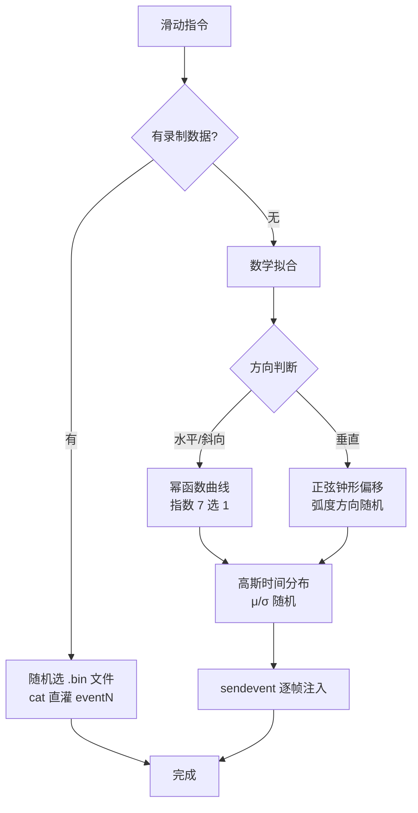

# 第 16 章 滑动轨迹拟合

> 用幂函数曲线 + 高斯速度分布拟合人手滑动，从轨迹和时间两个维度逼近真实触控。

Android 的 `input swipe` 是匀速直线运动。在主流 App 的风控模型眼里，这种运动一眼就是机器行为。

adb-bot 的滑动不走 `input swipe`，而是通过 sendevent 逐帧注入坐标，自己算轨迹和速度。

---

## 问题拆解

先想清楚一个问题：**人手滑动和机器滑动到底差在哪？**

拆到可建模的粒度，有三个特征：

1. **轨迹是曲线** — 受手腕旋转影响，略带弧度，不是直线
2. **速度是钟形** — 起步慢、中间快、收尾减速，不是匀速
3. **每次都不同** — 同一个人滑两次，轨迹和速度也不重合

剩下的工作就是针对这三个特征逐一拟合。

## 轨迹拟合：幂函数而非贝塞尔

贝塞尔是轨迹拟合的经典方案，第一反应都会想到它。我们否了它：

- 控制点调整不直觉，难以保证曲线严格经过起止点
- 控制点数量和位置的选择本身是个优化问题，引入额外复杂度

最终选了幂函数 `y = a · x^sqrt + b`，原因很直接：

- **指数直接控制曲线形态**：`sqrt < 1` 先陡后缓，`sqrt > 1` 先缓后陡，语义明确
- **端点严格命中**：代入起止两点解 a、b，不需要额外约束
- **随机性天然支持**：指数从 7 个值里随机选，每次曲线形态不同

代价是灵活度不如贝塞尔，但滑动场景不需要复杂形状，够用就行。

垂直滑动（startX == endX）幂函数分母为零，退化为正弦偏移：起止偏移为零、中段最大，弧度方向和幅度随机。

## 时间拟合：起步慢、中间快、收尾慢

匀速滑动是最明显的机器特征。人手的速度是钟形分布——大脑发指令到手部加速需要时间，接近终点要减速精准定位。

用高斯函数描述这个速度曲线：

- progress = μ 时速度最快（帧间隔最短）
- 两端速度最慢（帧间隔最长）
- μ 和 σ 都随机，每次滑动的加减速节奏不同

## 整体决策流程

这里有一个关键设计：**有录制数据时优先回放，数学拟合是兜底方案**。

再精巧的数学拟合也是人造曲线。预录真人滑动数据（每个方向 9 份，随机选取）是内核级真实事件流，保真度最高。数学拟合的价值在于零部署成本下也能用。

## 随机化清单

每次滑动至少 7 个独立随机点，确保不可重复：

| 随机点 | 作用 |
|--------|------|
| 曲线指数（7 种） | 轨迹整体形态 |
| 弧度方向（±1） | 左弯还是右弯 |
| 弧度幅度（20~60px） | 弯曲程度 |
| 步长抖动（±25%） | 帧间距不均匀 |
| 帧数（15~20） | 总帧数随位移自适应 |
| 时间 μ / σ | 加减速节奏 |
| 帧间间隔（±6ms） | 微观速度波动 |

## 关键代码

| 方法 | 说明 |
|------|------|
| `AbstractDevice.buildPass()` | 幂函数轨迹生成 |
| `AbstractDevice.buildVerticalPass()` | 正弦偏移垂直轨迹 |
| `AdbCmdUtil.calcGaussInterval()` | 高斯时间分布 |
| `AdbCmdUtil.buildSwipeScript()` | 分块编码脚本生成 |
| `AdbCmdUtil.swipeByRecordOrScript()` | 录制脚本回放 |

---

> 本文是《adb-bot 技术内幕》系列第 16 章。
> 更多内容见 [GitHub 仓库](../../README.md) | [官网](https://adb-bot.hilbp.com)
>
> [← 第 15 章 设备自动适配](15-device-autodetect.md) ｜ [目录](../README.md) ｜ [第 17 章 行为级仿真 →](17-behavior-simulation.md)
