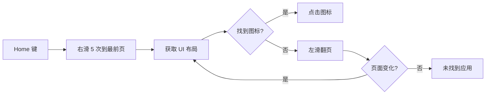

# 第 17 章 行为级仿真与工程优化

> 仿真不止是轨迹拟合。打开 App 怎么找图标、返回怎么滑、停顿多久、临时文件怎么清理——这些行为级细节同样决定成败。

---

前面几章解决了"单次点击和滑动像不像人"。但真实场景中，风控系统不只看单个动作，还看操作序列的模式。每次都从固定位置滑动、每次点击后零延迟执行下一步、用 `am start` 直接启动 App——这些行为模式比滑动轨迹更容易暴露。

## 行为级仿真

### 应用启动：逐页找图标而非 am start

`am start -n 包名/Activity` 是最直接的启动方式，但它绕过了 Launcher，在系统层面留下了"非用户操作"的痕迹。

adb-bot 的做法是模拟真人启动 App：回主屏 → 右滑到最前一页 → 逐页左滑翻找图标 → 找到后点击。



代价是慢（每次启动要翻几页），但对于严格风控场景值得。如果用户只关心速度，可以在流程节点中直接填包名，走 `openApp` 快速启动。

### 返回手势：优先回放再降级

Android 返回有两种方式：按键（keyevent 4）和手势（屏幕边缘滑动）。真人在全面屏设备上更多用手势返回。

优先级：root + `swipe_back` 录制脚本存在 → sendevent 回放录制数据 → 否则降级 keyevent 4。

### 操作后随机等待

每个动作执行后不是立即执行下一个，而是随机等待一段时间。这个等待模拟人类的反应时间（看页面加载、决定下一步）。

### 坐标随机化

模板匹配命中的坐标不每次都点正中心，而是在匹配矩形内随机取点。真人点击同一个按钮，每次落点都有微小偏移。

## 工程优化

### 不花屏工程

这是整个仿真模块里最容易被忽视、但影响体验最大的工程问题。

sendevent 逐条执行时，每次产生一个 shell 进程（fork）。一次滑动 50 条事件 = 50 次 fork。scrcpy 的 video 编码也在消耗 CPU。两者叠加 → CPU 饱和 → scrcpy 编码延迟 → 画面花屏。

解决方案在上一章提过：事件列表编码为二进制，用 `cat` 一次写入。但滑动还有一个额外问题——帧间需要 `usleep` 控制速度。所以最终的脚本结构是分块 cat：

```
echo <block1_base64> | base64 -d > tmp && cat tmp > /dev/input/eventN
usleep <interval>
echo <block2_base64> | base64 -d > tmp && cat tmp > /dev/input/eventN
usleep <interval>
...
```

每块 1 个坐标帧（约 7 条事件），块数和帧间间隔由高斯时间拟合决定。整个脚本一次提交给 su 执行，只有一个 fork。

### 临时文件安全

临时文件用 PID 命名（`_e$$`），`trap "rm -f $F" EXIT` 保证异常退出时也清理。并发操作时多台设备的临时文件互不干扰。

## 仿真能力清单

| 仿真维度 | 机制 | 章节 |
|----------|------|------|
| 点击事件层级 | sendevent 内核注入 | 第 14 章 |
| 触摸指纹 | track id / touch_major / 帧数随机 | 第 14 章 |
| 滑动轨迹 | 幂函数曲线 + 钟形偏移 | 第 16 章 |
| 滑动速度 | 高斯时间分布 | 第 16 章 |
| 滑动保真 | 录制脚本回放 | 第 16 章 |
| App 启动 | 逐页找图标 | 本章 |
| 返回操作 | 手势回放优先 | 本章 |
| 操作间隔 | 随机等待 | 本章 |
| 坐标落点 | 匹配矩形内随机 | 本章 |

## 关键代码

| 方法 | 说明 |
|------|------|
| `Open.operate()` | 应用启动仿真（逐页找图标） |
| `AdbCmdUtil.back()` | 返回手势优先级分派 |
| `AdbCmdUtil.backBySwipe()` | swipe_back 录制脚本回放 |
| `ActionGuardUtil.afterActionRandomWait()` | 操作后随机等待 |
| `JavacvMatchUtil.getMatchedRandomCoord()` | 匹配点坐标随机化 |
| `AdbCmdUtil.buildSwipeScript()` | 分块 cat 脚本生成 |

---

> 本文是《adb-bot 技术内幕》系列第 17 章。
> 更多内容见 [GitHub 仓库](../../README.md) | [官网](https://adb-bot.hilbp.com)
>
> [← 第 16 章 滑动轨迹拟合](16-swipe-trajectory.md) ｜ [目录](../README.md) ｜ [第 18 章 ADBKeyBoard 广播注入 →](../part-6-input/18-adbkeyboard-injection.md)
