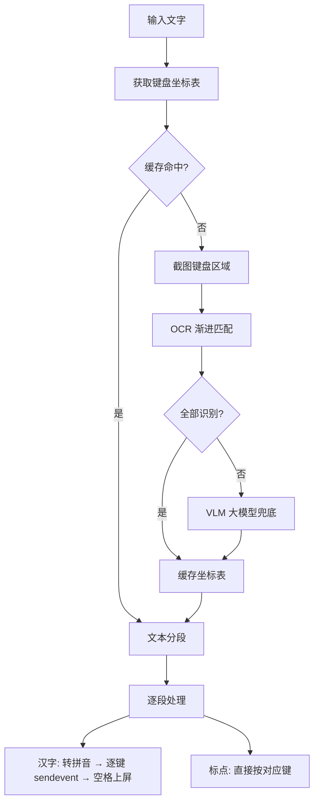

# 第 19 章 T9 九宫格拼音仿真

> OCR 识别键盘坐标，逐键 sendevent 注入，让文字输入在事件层级与真人无差异。

---

ADBKeyBoard 广播注入快且全字符集，但它在 InputMethodService 层面留下痕迹——文字是通过 `commitText` 一次性上屏的，而不是逐字键入。对于评论、发消息等有严格风控检测的场景，这种"瞬间出现整段文字"的行为本身就是异常信号。

第二输入引擎的目标是：完全模拟真人在九宫格拼音键盘上打字的过程。

## 核心设计

### 键盘坐标识别：三层降级

这是整个引擎最难的部分。九宫格键盘上每个按键的位置因机型、输入法版本、屏幕方向而异，不能写死。

**第一层：OCR 渐进匹配**

截取屏幕下 1/3（键盘区域），盖住上 2/3 排除候选词栏干扰。用 Tesseract 英文 OCR + 字母白名单识别每个按键组（"ABC"、"DEF" 等）。

识别不是一次匹配，而是三级降级：

| 级别 | 匹配目标 | 容错场景 |
|------|---------|---------|
| 完整组 | "ABC" | OCR 完美识别 |
| 2 字母子串 | "AB"、"BC" | OCR 漏读最后一个字母 |
| 单字母 | "A"、"B"、"C" | OCR 只识别出一个字母 |

只要任一级别命中，就能定位到这个按键的坐标。这种渐进策略保证了即使 OCR 误读个别字母，仍能通过部分匹配找到正确位置。

**第二层：VLM 大模型兜底**

OCR 全部失败时（极少见，通常是因为键盘皮肤特殊导致 OCR 无法识别），截图发送给多模态大模型，prompt 要求返回每个按键组的中心坐标 JSON。

**第三层：空格键推算**

九宫格键盘的空格键通常没有文字标识，OCR 和 VLM 都无法直接识别。但空格键的位置有规律：在 TUV 键的正下方，行间距等于 JKL 到 TUV 的距离。用这个规律推算空格坐标。

### 拼音转换

汉字转无声调拼音用 pinyinhelper 库。但库的默认读音在某些常见字上不准（多音字），需要覆盖：

| 汉字 | 库默认 | 覆盖为 | 原因 |
|------|--------|--------|------|
| 呢 | NE | NE | 口语"呢"读 ne |
| 的 | 多种 | DE | 最常用读音 |
| 了 | 多种 | LE | 句末语气 |
| 着 | ZHAO | ZHE | "看着"读 zhe |
| 地 | 多种 | DE | "慢慢地"读 de |
| 得 | 多种 | DE | "走得好"读 de |

用户也可以在前端传入自定义拼音，精确控制每个字的读音，完全绕开库的转换。

### 分段输入策略

混合文本（中文+标点）不能简单逐字处理。按汉字/非汉字边界分段：连续汉字为一段（走拼音按键流程），连续标点为一段（直接按对应键）。

### 逐键注入 + 节奏模拟

每个字母通过 sendevent 点击对应九宫格按键坐标，按键间隔 150ms。按完一段拼音后按空格，第一候选词上屏。

150ms 的间隔是有意的——真人打字的速度大致在这个量级。太快会触发风控，太慢则效率不可接受。

### 与第一引擎的对比

| 维度 | ADBKeyBoard | T9 九宫格 |
|------|-------------|-----------|
| 注入层级 | InputMethodService | /dev/input/eventN |
| 上屏方式 | commitText 整段 | 逐字按键 |
| 事件真实度 | 低（有广播痕迹） | 高（与真人无差异） |
| 速度 | 快 | 慢（150ms/键） |
| 字符集 | 全字符集 | 仅中文+标点 |
| 适用场景 | 搜索/表单 | 评论/话术 |

## 关键代码

| 方法 | 说明 |
|------|------|
| `T9Typer.typeWithPinyin()` | 九宫格输入主流程 |
| `KeyboardCoordCache.detectNineKeyCoords()` | 坐标识别链（OCR → VLM） |
| `KeyboardCoordCache.matchKeyProgressive()` | OCR 三级渐进匹配 |
| `KeyboardCoordCache.detectByVision()` | VLM 大模型兜底 |
| `KeyboardCoordCache.addSpaceKeyCoord()` | 空格键行距推算 |
| `PinyinMapper.toPinyin()` | 拼音转换 + 多音字覆盖 |
| `PinyinMapper.splitByPunctuation()` | 文本分段 |
| `T9Typer.pressPinyin()` | 逐键 sendevent 注入 |

---

> 本文是《adb-bot 技术内幕》系列第 19 章。
> 更多内容见 [GitHub 仓库](../../README.md) | [官网](https://adb-bot.hilbp.com)
>
> [← 第 18 章 ADBKeyBoard 广播注入](18-adbkeyboard-injection.md) ｜ [目录](../README.md) ｜ [第 20 章 统一元素定位体系 →](../part-7-vision/20-element-location.md)
