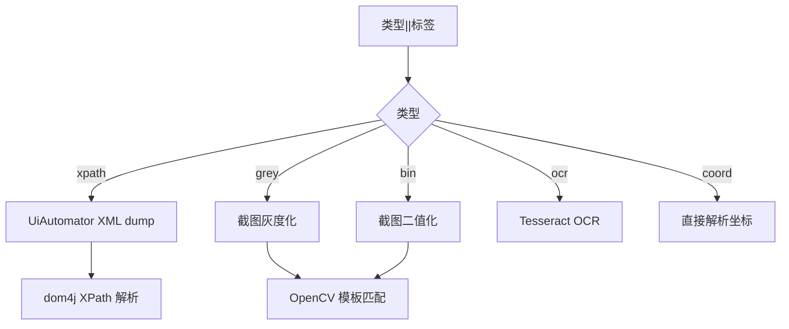

# 第 20 章 统一元素定位体系

> 五种定位策略统一入口，多标签兜底，匹配点坐标随机化。

---

自动化操作的核心是"找到屏幕上的元素在哪"。Android 屏幕上的元素可以用多种方式描述：文字内容、XPath、图片模板、OCR 文字、固定坐标。每种方式各有优劣，适用场景不同。

adb-bot 的设计目标是：用户不需要关心用哪种方式，只需要用 `类型||标签` 的统一格式描述目标，系统自动选择最优策略。

## 核心设计

### 统一入口

```
模板格式：类型||标签

示例：
  xpath||//node[@text='登录']
  grey||login_btn.png
  bin||icon.png
  ocr||确认
  coord||540,960
```

`ScreenMatchUtil` 解析模板格式，按类型分发到对应的定位引擎。

### 五种定位策略



| 策略 | 原理 | 可靠性 | 适用场景 |
|------|------|--------|---------|
| xpath | UiAutomator dump XML + XPath 查询 | 高 | 文字/ID 明确的元素 |
| grey | OpenCV 灰度模板匹配 | 高 (0.994) | 彩色图标 |
| bin | OpenCV 二值化模板匹配 | 高 (0.995) | 高对比度图标 |
| ocr | Tesseract 文字识别 | 中 | 动态文字内容 |
| coord | 固定坐标 | 低 | 兜底（分辨率敏感） |

### 多标签兜底

标签支持数组格式 `[a,b,c]`，依次尝试直到命中：

```
xpath||[//node[@text='登录'], //node[@resource-id='com.app:id/btn_login']]
```

第一个 XPath 没找到？试第二个。都没找到才报错。这在 App 版本更新导致元素属性变化时很有用——多个备选标签提高了流程的鲁棒性。

### OpenCV 模板匹配

用 `TM_CCORR_NORMED`（归一化互相关）算法，阈值 0.994（灰度）/ 0.995（二值化）。

二值化模式（`bin`）在匹配前对源图和模板都做 `threshold(THRESH_BINARY_INV, 240)`——把彩色变黑白，只保留形状信息。这在图标背景颜色变化时更稳定。

### 匹配点随机化

模板匹配命中的是左上角坐标，真人点击不会每次都点正中心。`getMatchedRandomCoord` 在匹配矩形 `[x, x+w] × [y, y+h]` 范围内随机取点，避免每次点击相同坐标。

### OCR 渐进识别

Tesseract 不是一次调用就出结果。而是渐进尝试多种预处理：

| 级别 | 预处理 | 适用场景 |
|------|--------|---------|
| 原图 | 无 | 清晰白底黑字 |
| 灰度 | greyImg | 一般场景 |
| 二值化 (210) | 固定阈值 | 低对比度 |
| 动态 (200→100) | 步长 20 递减 | 极低对比度 |

每个阈值级别都尝试一次 OCR，命中即返回。双 ThreadLocal 实例：`chi_sim`（中文）和 `eng`（英文字母白名单）。

### XPath 选最小节点

`getSmallestTargetNodeCoord` 在所有匹配节点中选面积最小者。这是因为 XPath 可能同时命中外层容器和内层按钮（如 `//node[@text='登录']` 可能匹配到按钮和包裹按钮的 Layout）。选面积最小的就是最精确的元素本身。

### 页面识别

`isTargetPage` 用于判断"当前在哪一页"，支持同样的多策略：

| 策略 | 判定方式 |
|------|---------|
| text | XML 中包含目标文字 |
| activity | `currentActivity` 匹配 |
| xpath | XML 中存在目标节点 |
| grey/bin | 模板匹配命中 |
| ocr | OCR 识别到目标文字 |

## 关键代码

| 方法 | 说明 |
|------|------|
| `ScreenMatchUtil.getTemplateCoords()` | 统一入口，按类型分发 |
| `JavacvMatchUtil.matching()` | OpenCV TM_CCORR_NORMED 模板匹配 |
| `JavacvMatchUtil.getMatchedRandomCoord()` | 匹配矩形内随机取点 |
| `Tess4jOcrUtil.getTextCoords()` | OCR 渐进阈值链 |
| `XmlDom4jUtil.getSmallestTargetNodeCoord()` | XPath 最小节点选择 |

---

> 本文是《adb-bot 技术内幕》系列第 20 章。
> 更多内容见 [GitHub 仓库](../../README.md) | [官网](https://adb-bot.hilbp.com)
>
> [← 第 19 章 T9 九宫格拼音仿真](../part-6-input/19-t9-pinyin-simulation.md) ｜ [目录](../README.md) ｜ [第 21 章 授权模型 →](../part-8-security/21-license-model.md)
