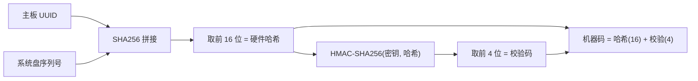

# 第 21 章 授权模型

> HMAC 机器码 + RSA 验签 + 三路冗余试用存储 + 云端心跳 + 反射防护。

---

商业软件需要授权机制。adb-bot 的授权体系需要在离线环境下工作（大多数设备不联网），同时支持云端管控（远程封禁、设备数限制）。设计上的核心矛盾是：**安全性 vs 可用性**——太严会误伤合法用户，太松会被破解。

## 核心设计

### 机器码：硬件指纹 + HMAC 防伪



20 位机器码 = 硬件哈希(16位) + HMAC 校验(4位)。

**采集原则**：只选最稳定的标识——主板 UUID（BIOS 级，重装系统不变）和系统盘序列号（精确反查系统盘符）。MAC 地址只记日志不参与生成（网卡更换频繁）。虚拟网卡（docker/vmnet/vbox）被过滤。

**HMAC 防伪**：4 位校验码防止手工伪造硬件哈希。没有 HMAC 密钥，攻击者无法构造合法的 20 位机器码。

### RSA-2048 授权码验签

授权码格式：`Base64(JSON内容) + "." + Base64(RSA签名)`

内容包含：机器码、过期日期、作者、使用者、设备数限制、在线/离线类型。

公钥硬编码在代码中（受 class-winter 加密保护），客户端只验签不签发。私钥在云端 license-sign.jks 中，签发操作只在服务端进行。

### 三路冗余试用存储

试用模式下（无授权码），试用期由 `.trial` 文件控制。但单个文件容易被删除重置。三路冗余：

| 路径 | 位置 | 平台 |
|------|------|------|
| 主文件 | `~/.adb-bot/.trial` | 全平台 |
| 影子文件 | `%LOCALAPPDATA%/adb-bot/.cfg` | Windows / macOS / Linux |
| Java Preferences | 注册表 / `~/.java/.userPrefs` | 全平台 |

**HMAC 防篡改**：每路存储都有 HMAC 签名。任一路签名不匹配 → 直接判过期，不给恢复机会。

**取最早日期**：三路正常加载后，取最早的 `firstStartDate` 作为试用起始日。这样即使删除了主文件，影子文件和注册表中的日期仍然保留。

**自动修复**：某一路缺失时，从最早的正常数据恢复。

### AuthState 反射防护

攻击者可能通过反射修改内存中的授权状态字段。`AuthState` 用三重校验防护：

```java
class AuthState {
    boolean flag;        // 授权有效？
    int checksum;        // flag 的校验码
    long startupTime;    // 启动时间戳
    
    // checksum = (flag ? 0x5A5A5A5A : 0xA5A5A5A5) ^ 0x12345678
    // isValid(): flag 和 checksum 必须一致 + startupTime 匹配真实启动时间
}
```

攻击者反射修改 `flag = true` 后，`checksum` 不匹配，`isValid()` 返回 false。要同时伪造 flag + checksum + startupTime 三个字段，需要知道 XOR 常量和真实启动时间——后者绑定 `System.nanoTime()`，攻击者无法获取。

### 云端心跳

在线授权码定期上报心跳（machineCode + licenseCode + version）。服务端响应三态：

| 响应 | 处理 |
|------|------|
| allow | 正常运行 |
| warn | 警告但可用 |
| block | 强制失效 + 前端全屏遮罩 |

连续心跳失败 ≥5 次 → 标记超时，Level 3 API 被拦截。但网络不通时不算失败（容错原则：离线为主，在线为辅）。

### LicenseFilter 三级拦截

| 级别 | 校验 | 适用 API |
|------|------|---------|
| 默认 | 放行 | 静态资源、只读 API |
| Level 2 | 需有效授权 | 写操作 API |
| Level 3 | 授权 + 设备数 + 心跳 | 核心操作 API |

白名单式设计：新增只读 API 默认放行，不会被误拦。

## 关键代码

| 类/方法 | 说明 |
|---------|------|
| `MachineCodeUtil` | 硬件指纹采集 + HMAC 机器码生成 |
| `LicenseUtil` | RSA-2048 验签 |
| `TrialFile` | 三路冗余试用存储 |
| `LicenseService.AuthState` | 反射防护三重校验 |
| `LicenseFilter` | 三级 HTTP 拦截 |

---

> 本文是《adb-bot 技术内幕》系列第 21 章。
> 更多内容见 [GitHub 仓库](../../README.md) | [官网](https://adb-bot.hilbp.com)
>
> [← 第 20 章 统一元素定位体系](../part-7-vision/20-element-location.md) ｜ [目录](../README.md) ｜ [第 22 章 JAR 加固链 →](22-jar-hardening.md)
