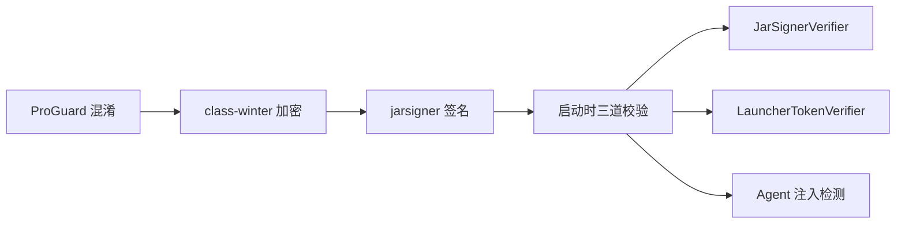

# 第 22 章 JAR 加固链

> class-winter 字节码加密 + jarsigner 签名 + 启动器令牌验证 + Agent 注入检测。

---

Java 应用的 class 文件很容易被反编译。授权逻辑再严密，如果攻击者反编译看到了 RSA 公钥和验签逻辑，就能针对性地绕过。JAR 加固的目标是提高逆向成本，让攻击者无法通过静态分析理解代码逻辑。

## 加固链

### ProGuard 混淆

只混淆不压缩不优化（`-dontshrink -dontoptimize`），降低运行时风险。自定义字典文件让混淆后的类名不可读（`a.java` `b.java` ...），`-repackageclass ''` 打平包结构。

保留规则：Spring Boot 入口类、注解驱动的 Bean、Activiti 反射入口、实体类、Controller/License/Security 类全保留（这些类被框架反射调用，混淆会破坏功能）。

### class-winter 字节码加密

class-winter 对 .class 文件做 AES 加密，运行时由自定义 ClassLoader 解密加载。密钥绑定在启动器中，脱离启动器无法解密。

同时绑定 `DisableAttachMechanism` JVM 参数——禁止 Java Attach API，防止攻击者用 attach 工具在运行时 dump 解密后的 class。

### jarsigner 签名

ProGuard 混淆 + class-winter 加密后的 JAR，再用 jarsigner 做 RSA 签名（签名别名 `adbbot`，密钥库 `adbbot-sign.jks`）。签名保证 JAR 未被篡改。

### JarSignerVerifier：运行时签名校验

启动时通过 `getProtectionDomain().getCodeSource()` 定位自身 JAR，遍历所有 entry，完整读取后检查 `getCertificates()`。

**完整读取才取证书**：这是关键。如果只检查 entry 是否存在（不读取内容），攻击者可以在 JAR 尾部追加未签名的 class 文件，Java 的延迟签名校验不会检测到。完整读取确保每个 entry 都被签名覆盖。

未签名 entry → `System.exit(1)`。

### LauncherTokenVerifier：启动器令牌

防止脱离 C 启动器直接运行 JAR。启动器在启动 JVM 时传入两个参数：
- `agentToken`：明文 hash
- `cipherToken`：AES 加密的 token

验证流程：
1. 从 4 段常量（`K1~K4`，每段 4 字节）组装 AES 密钥——先用 `KEY_MASKS` 异或，再循环左移 1 位 + XOR 0x55
2. AES-ECB 解密 cipherToken
3. SHA-256 → 与 agentToken 比较
4. 匹配才放行

密钥混淆组装让静态分析难以提取 AES 密钥——4 段常量散布在代码中，不经过掩码运算和位移无法还原。

同时检查 JVM 参数含 `DisableAttachMechanism`，缺失则拒绝启动。

### Agent 注入检测

`main()` 方法中扫描所有 JVM 参数，检测 `-javaagent` / `-agentlib` / `-agentpath` / `-xrun`。放行 class-winter 自身的 agent 和 IDE 已知的 agent（开发环境兼容），拦截其他所有注入尝试。

### Named Pipe 密码传递

C 启动器和 JVM 之间的密码通过 Windows Named Pipe 传递，管道名含 64 位随机值防劫持，永不落盘。

## 关键代码

| 类/方法 | 说明 |
|---------|------|
| `JarSignerVerifier.verify()` | JAR 签名完整性校验 |
| `LauncherTokenVerifier.verify()` | AES 密钥重组 + token 验证 |
| `AdbBotWebApplication.main()` | 三道安全检查链 |
| `proguard.pro` | 混淆规则 |

---

> 本文是《adb-bot 技术内幕》系列第 22 章。
> 更多内容见 [GitHub 仓库](../../README.md) | [官网](https://adb-bot.hilbp.com)
>
> [← 第 21 章 授权模型](21-license-model.md) ｜ [目录](../README.md) ｜ [第 23 章 通信安全 →](23-communication-security.md)
