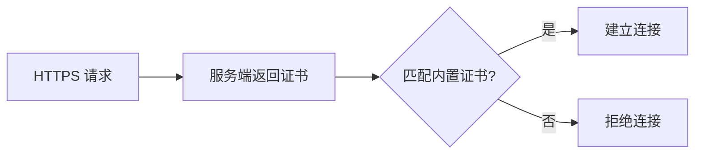

# 第 23 章 通信安全

> HTTPS 证书固定防中间人、HMAC 请求签名防重放、按域名隔离的证书包。

---

授权和心跳需要和云端通信。但 HTTP 通信面临两个威胁：中间人攻击（流量被劫持篡改）和重放攻击（合法请求被截获后重复发送）。

## 核心设计

### 证书固定（Certificate Pinning）

常规 HTTPS 信任系统 CA 证书链，任何被系统信任的 CA 签发的证书都能建立连接。这意味着如果攻击者持有一个合法 CA 签发的证书（或通过企业代理的 CA），就能实施中间人攻击。

证书固定的做法：只信任我们自己内置的那一张证书。



实现：从 cert zip 包解压 X.509 证书，构建自定义 TrustStore 只包含这张证书。SSLContext 用这个 TrustStore 初始化，不信任系统 CA。

**zip MD5 缓存**：证书包首次解压后记录 MD5，后续启动时先比较 MD5，未变化则跳过解压。

**按域名隔离**：每个域名（API 服务端、文件服务器等）有独立的证书包，互不干扰。

### HMAC-SHA256 请求签名

每个请求附带时间戳和 HMAC 签名：

```
签名 = HMAC-SHA256(apiSecret, timestamp + path + bodyJson)
Header: X-Timestamp + X-Signature
```

**apiSecret 从证书包加载**：密钥不和代码绑定，而是和证书绑定。更换密钥只需更新证书包，不需要重新编译。

**5 分钟防重放**：服务端检查 `X-Timestamp` 与当前时间的差值，超过 5 分钟拒绝。这防止截获的请求被重复发送（即使签名有效）。

### 心跳上报

定时上报 machineCode + licenseCode + version + deviceCount + event。每次请求都带 HMAC 签名。

服务端响应三态：`allow`（正常）/ `warn`（警告）/ `block`（封禁）。`block` 时附带 broadcastMessage 推送到前端全屏遮罩。

### 容错原则

**离线优先**：网络不通或请求超时（2s）时，不算心跳失败，软件照常运行。只有服务端主动返回 `block` 才阻断。

连续失败 ≥5 次（真正的 HTTP 错误，不是超时）才标记超时，Level 3 API 被拦截。这个阈值避免了网络抖动导致的误判。

## 关键代码

| 类/方法 | 说明 |
|---------|------|
| `LicenseCloudService` | 证书固定 + HMAC 签名 + 心跳 |
| `LicenseCloudService.createSSLContext()` | 自定义 TrustStore 构建 |
| `LicenseCloudService.signRequest()` | HMAC-SHA256 签名生成 |

---

> 本文是《adb-bot 技术内幕》系列第 23 章。
> 更多内容见 [GitHub 仓库](../../README.md) | [官网](https://adb-bot.hilbp.com)
>
> [← 第 22 章 JAR 加固链](22-jar-hardening.md) ｜ [目录](../README.md) ｜ [第 24 章 数据保护 →](24-data-protection.md)
