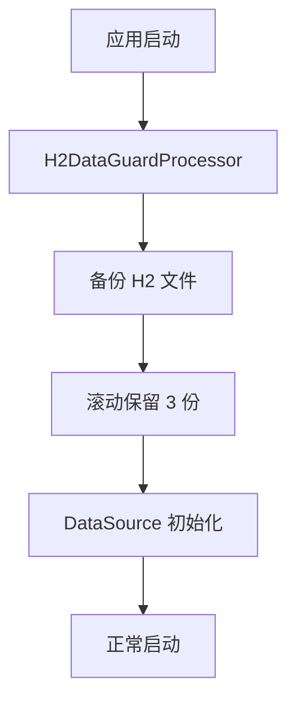
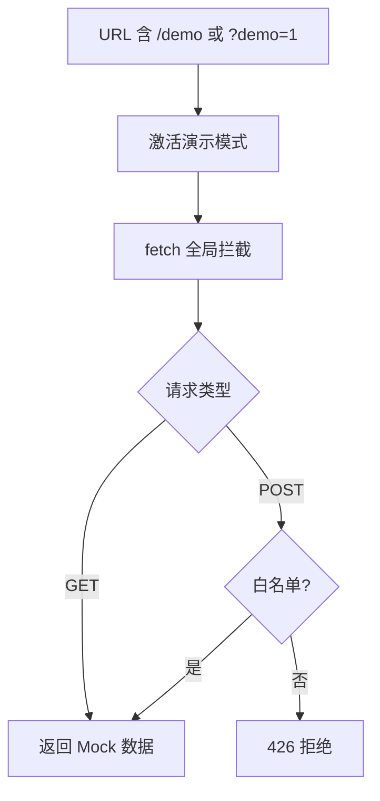

# 第 24 章 数据保护

> H2 嵌入式数据库的冷备份、损坏检测与自动恢复，以及演示模式引擎。

---

adb-bot 用 H2 嵌入式数据库存储流程定义、AI 配置、定时任务等数据。嵌入式数据库的好处是零配置，但风险是文件损坏（异常断电、磁盘错误）会导致数据丢失。本章解决数据持久化的可靠性问题，同时覆盖演示模式引擎的实现。

## H2 数据保护

### 冷备份

启动时自动备份 H2 数据库文件，滚动保留最近 3 份。备份发生在 DataSource 初始化之前（通过 `EnvironmentPostProcessor` 先于 Spring 自动配置执行）。

### 损坏检测与恢复

H2 文件损坏时，JDBC 连接会抛异常。如果不处理，应用无法启动。恢复流程：

1. 检测到连接异常
2. 将损坏的 H2 文件改名 `.corrupt`（保留现场）
3. 从最新备份恢复
4. 重新初始化连接

### EnvironmentPostProcessor 先于 DataSource

`H2DataGuardProcessor` 实现 Spring 的 `EnvironmentPostProcessor`，在 `DataSourceAutoConfiguration` 之前执行。这保证了备份和健康检查在数据库连接建立之前完成。

如果延迟到 `@PostConstruct` 执行，DataSource 已经持有了损坏的连接句柄，恢复无效。

## 演示模式引擎

演示模式让用户无需连接真实设备就能体验软件功能。它通过全局拦截前端请求实现，正式环境完全无感知。

| 拦截对象 | 处理方式 |
|----------|---------|
| GET 请求 | 返回预置 Mock 数据（设备列表、截图、UI 树等） |
| POST 请求 | 白名单放行，其余返回 426 |
| AI 对话 | 关键词匹配 + 800~2000ms 随机延迟模拟回复 |
| SockJS | 假连接 + 定时推假日志 |
| WebSocket | 立即 close（不连真实 scrcpy） |

**JMuxer 空实现**：防止投屏模块在无视频流时报错。

**Font Awesome CDN fallback**：检测字体宽度，加载失败时切换备用 CDN。

**SVG 占位截屏**：演示模式的"截图"是预置的 SVG 图片，不依赖设备。

**BPMN 示例注入**：`window.__adbDemoGetBpmn` 提供示例流程 XML，让用户在编辑器中看到真实效果。

## 关键代码

| 类/方法 | 说明 |
|---------|------|
| `H2DataGuardProcessor` | 启动前备份 + 健康检查 |
| `mock.js` | 演示模式全链路 Mock |

---

> 本文是《adb-bot 技术内幕》系列第 24 章。
> 更多内容见 [GitHub 仓库](../../README.md) | [官网](https://adb-bot.hilbp.com)
>
> [← 第 23 章 通信安全](23-communication-security.md) ｜ [目录](../README.md) ｜ [附录 A Selenium Web 自动化引擎 →](../appendix/a-selenium-engine.md)
